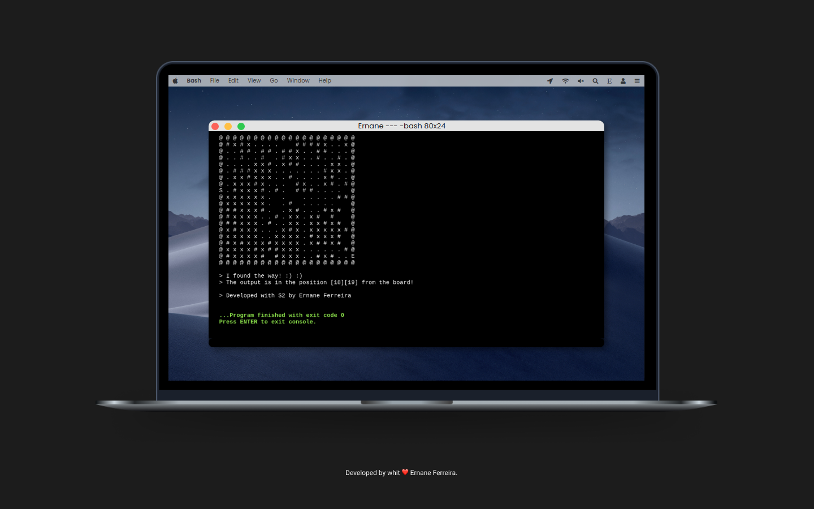

<h1 align="center">
  <strong>Smart Maze</strong>
</h1>

  <a href="#-Technologies">Technologies</a>&nbsp;&nbsp;&nbsp;|&nbsp;&nbsp;&nbsp;
  <a href="#-Project">Project</a>&nbsp;&nbsp;&nbsp;|&nbsp;&nbsp;&nbsp;
  <a href="#-Run">Run</a>&nbsp;&nbsp;&nbsp;

 

  

  

## 🚀 Technologies

<b> PT-br</b>

Este aplicativo foi desenvolvido com as seguintes tecnologias:

This application was developed with the following technologies:

- C++

## 💻 Project

<b> PT-br</b>

Labirinto inteligente. O sguinte projeto solicita ao usuário um numero `n` qualquer e com base nesse número o mesmo cria um tabuleiro matricial nxn. Nesse tabuleiro é adicionado obstáculos de forma aleatória com cerca de 70% de precisão, bem como, os locais de entrada e saida de forma aleatória e em lados opostos. De posse desse tabuleiro o algorítimo tenta buscar um caminho de saída e retorna ao usuário dois casos possíveis.  
    - A posição onde se encontra a saida do labirinto, informando a linha e coluna do caractere. 
    - Uma mensagem de alerta informando que não existe solução possível para aquele tabuleiro gerado. Podendo o usuário iniciar novamente o algoritmo com um tabuleiro diferente.

Smart Maze. This project asks the user for any number `n` and based on that number it creates an nxn matrix board. On this board, obstacles are added at random with about 70% accuracy, as well as entry and exit locations randomly and on opposite sides. With this board in hand, the algorithm tries to find an exit path and returns two possible cases to the user.
 - The position where the exit of the maze is located, informing the character's row and column.
 - An alert message informing you that there is no possible solution for that generated board. The user can start the algorithm again with a different board.

## 💡 Run

<b> PT-br</b>

Execute o arquivo ``maze.exe` ou rode o programa `maze.cpp` em seu compilador `c++`.

Run the `maze.exe` file or run the `maze.cpp` program in your `c++` compiler.

---

Developed with ❤ by <a target="_blank" href="https://ernanej.github.io/my-linktree/">Ernane Ferreira</a>. 👋🏻 